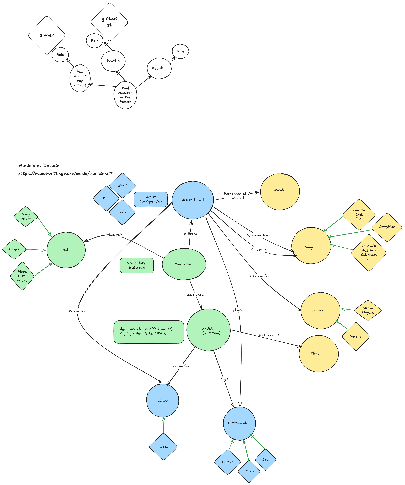

# Music Ontology

## Overview

This repository contains a developing music ontology created as part of a collaborative project.

The ontology models core musical concepts from the perspective of a Musician.
This is a learning exercise to apply rdf, rdfs concepts and bulids upon SKOS.

## Structure

The ontology is written in RDF/OWL and defines:

- Classes
- Properties
- Relationships between entities

## Contributors

- Loz
- Ayalet
- Jeff

## Notes

This ontology is a work in progress and will continue to evolve over time.